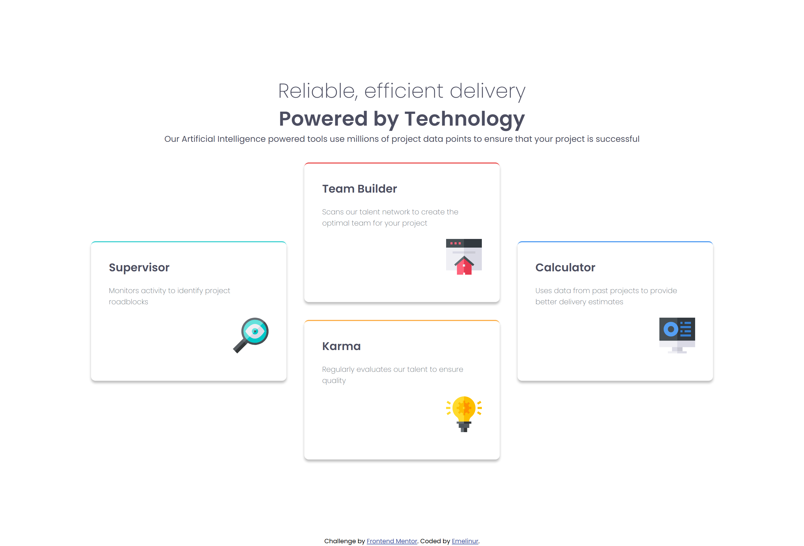
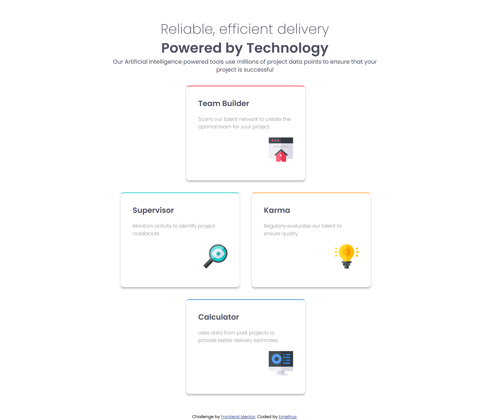
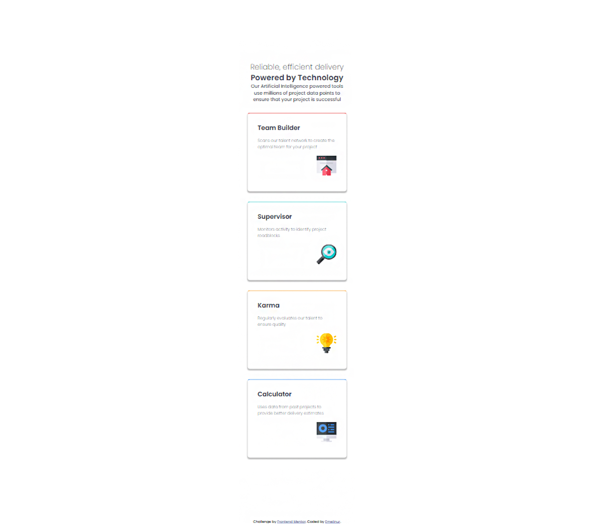

# Frontend Mentor - Four card feature section  

## Welcome! 👋 
This project is a solution to the [Frontend Mentor challenge](https://www.frontendmentor.io/challenges/four-card-feature-section-weK1eFYK).  
The goal was to recreate the design using **HTML** and **CSS Grid**, making it fully responsive across devices.

## 🚀 Live Demo & Code

- **Live Site:** [Add live URL here](https://emelinur.github.io/four-card-feature-section-master/)
- **Repository:** [GitHub Repo](https://github.com/Emelinur/four-card-feature-section-master)

---

## 🧰 Built With

- Semantic **HTML5**
- **CSS Grid** (main layout)
- Responsive **media queries**
- CSS custom properties (variables)
- **Google Fonts** – _Poppins_

---

## 🧠 What I Learned

During this challenge, I focused on mastering the **CSS Grid system**.

Key takeaways:

- Using `grid-template-columns`, `grid-row`, and `span` to create multi-row and multi-column layouts
- Designing responsive breakpoints for **mobile, tablet, and desktop**
- Maintaining consistent dimensions between cards using math (column width + gap + container width)

Learning resources I used:

- [W3Schools – CSS Grid](https://www.w3schools.com/css/css_grid.asp)
- [YouTube Tutorial](https://youtu.be/T01NU_rxjgY?si=Lhxq4U7IML59N4zy)
- Guidance and debugging with **ChatGPT** 💬

---

## 📸 Screenshots

| Desktop                          | Tablet                         | Mobile               |
| -------------------------------- | ------------------------------ | -------------------- |
|  |  |  |

_(Replace these with your actual project screenshots)_

---

## 🧩 How to Run

```bash
git clone https://github.com/Emelinur/four-card-feature-section-master.git
cd four-card-feature-section
# Open index.html in your browser
```
